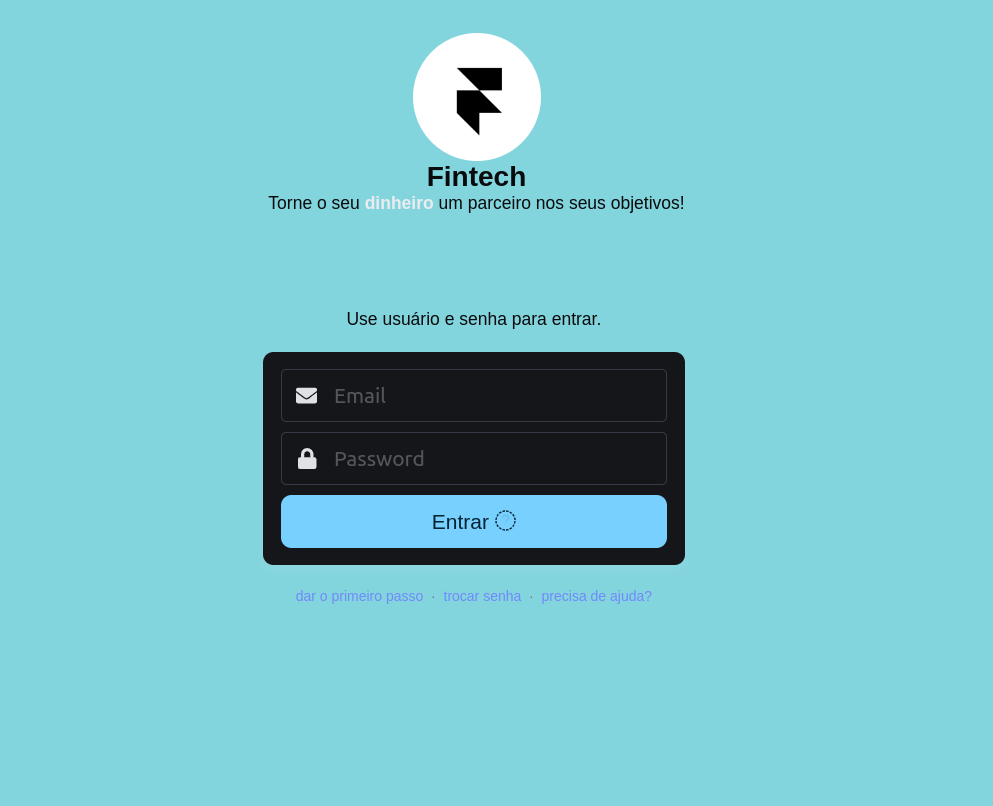
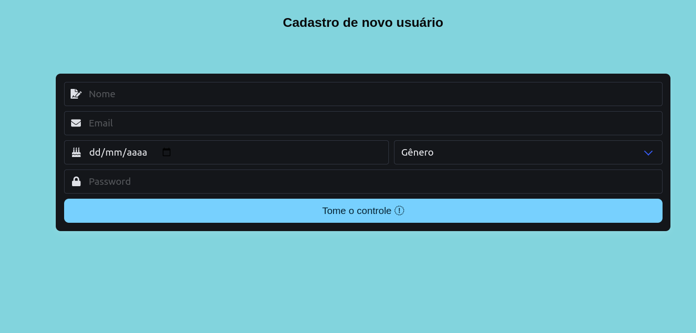

# README

Rails API to calculate products taxes in a shopping.

* **Technologies used**

	- [font-awesome 5.15.4](https://fontawesome.com/v5/search?o=r&m=free)

	- [Bulma Framework v1.0.0](https://bulma.io/)

* **How to use**

	- Just run in your browser `index.html` or `subscribe.html`

* ***Screenshot***

	> 

	> 
